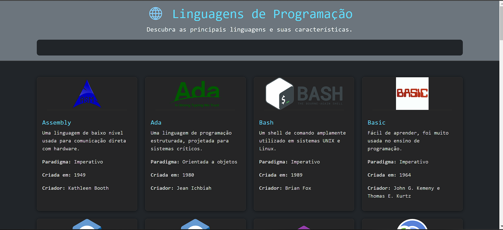

# Resumo de Linguagens de Programação

Este projeto é uma aplicação web que exibe um resumo das principais linguagens de programação, suas características, paradigmas, ano de criação e criadores. A aplicação permite que os usuários pesquisem por linguagens específicas e visualizem as informações em cards interativos.

## Funcionalidades

- **Pesquisa Dinâmica**: Os usuários podem pesquisar por linguagens de programação digitando no campo de busca. A lista de linguagens é filtrada em tempo real.
- **Cards Interativos**: Cada linguagem é exibida em um card que inclui o nome, descrição, paradigma, ano de criação e criador. Os cards são responsivos e interativos, com efeitos de hover.
- **Design Moderno**: A interface é estilizada com Bootstrap e CSS personalizado, com um tema escuro e cores que destacam os elementos importantes.

## Tecnologias Utilizadas

- **HTML**: Estrutura da página.
- **CSS**: Estilização da página, com foco em design responsivo e moderno.
- **JavaScript**: Lógica para renderização dinâmica dos cards e funcionalidade de pesquisa.
- **Bootstrap**: Framework CSS para facilitar a criação de layouts responsivos e componentes estilizados.

## Como Executar o Projeto

1. Clone o repositório para sua máquina local.
2. Abra o arquivo `index.html` no seu navegador.
3. Utilize o campo de busca para pesquisar por linguagens de programação e explore os cards exibidos.

## Estrutura do Projeto

- **index.html**: Arquivo principal que contém a estrutura HTML da página.
- **assets/css/styles.css**: Arquivo CSS com estilos personalizados.
- **assets/js/script.js**: Arquivo JavaScript com a lógica de renderização e filtragem das linguagens.

## Screenshot

Aqui está uma prévia do projeto:

 <!-- Substitua "screenshot.png" pelo nome do arquivo da imagem do seu projeto. -->

## Contribuição

Contribuições são bem-vindas! Se você quiser adicionar mais linguagens, melhorar o design ou adicionar novas funcionalidades, sinta-se à vontade para abrir uma issue ou enviar um pull request.

## Licença

Este projeto está licenciado sob a licença MIT. Veja o arquivo [LICENSE](LICENSE) para mais detalhes.

---

Feito com ❤️ por [Kleber M Kardel]